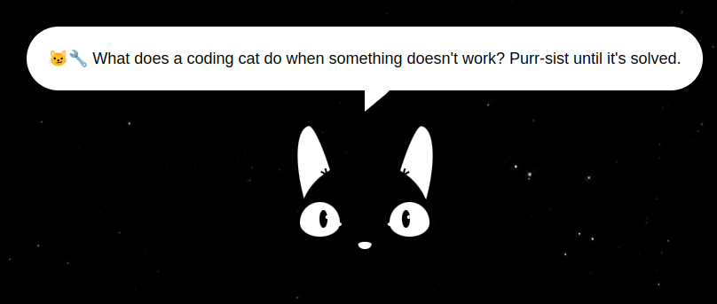

# Mi Landing Page Felina 🐾

¡Bienvenido a mi espacio personal en la web! Aquí encontrarás mi curriculum vitae y mi portafolio, todo presentado de una manera única y divertida: ¡con un gato que te sigue con la mirada mientras mueves el ratón! 😺



## ¿Cómo funciona?

Simplemente mueve el ratón y observa cómo el gato te sigue con sus ojos curiosos. ¡Espero que disfrutes de la experiencia tanto como yo disfruto programándola!

## Contenidos

- **CV:** Encuentra mi curriculum vitae actualizado con información sobre mi educación, experiencia laboral y habilidades.
- **Portafolio:** Explora algunos de los proyectos en los que he trabajado. Desde desarrollo web hasta aplicaciones, ¡hay un poco de todo!

## Tecnologías utilizadas

Este proyecto está construido con amor y las siguientes tecnologías:

- VUE
- Vite
- JavaScript

¡Sientete libre de explorar el código fuente y adaptarlo a tus necesidades!

## Project Setup

```sh
npm install
```

### Compile and Hot-Reload for Development

```sh
npm run dev
```

### Compile and Minify for Production

```sh
npm run build
```
